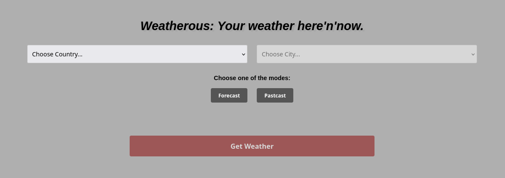
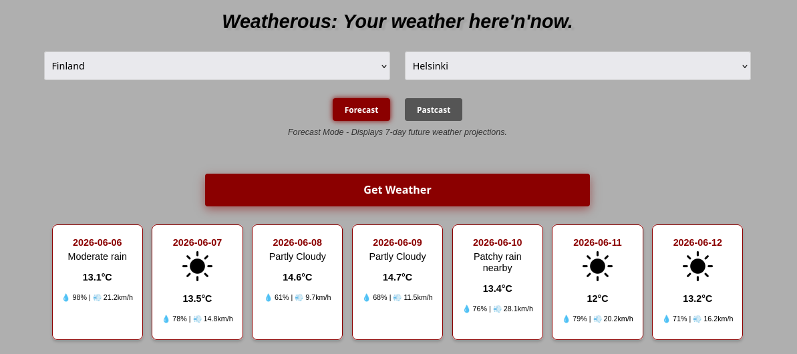
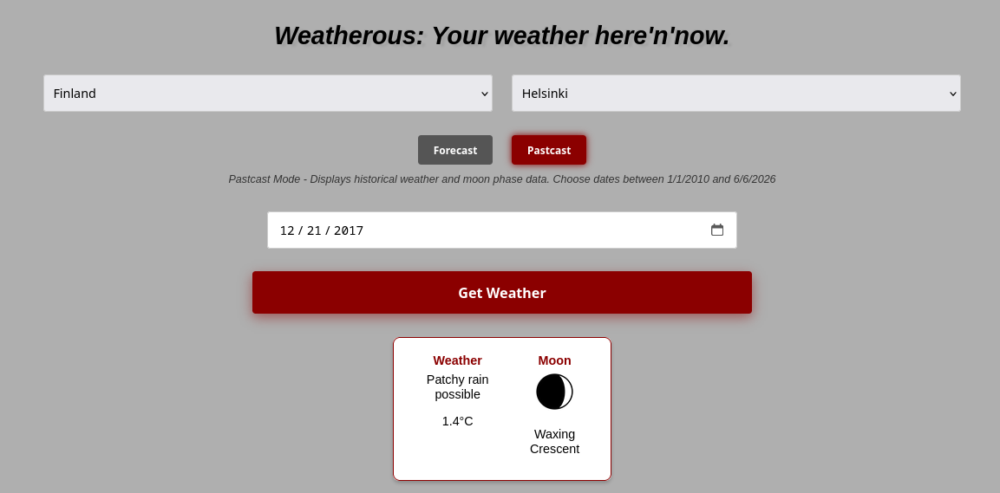

# WeatherousAPI

An all-in-one API module that makes it possible to fetch WeatherAPI into a basic web interface.

**WARNING: Insert your [WeatherAPI.com](https://www.weatherapi.com/) key into /backend/src/main/resources/application.properties replacing the "{YOUR API KEY HERE}" placeholder!** 

## How to use

The Backend/Frontend modules are shipped in seperate directories, and can be instantiated into a service right away with Docker Compose.

Project uses Nginx proxy to serve Frontend onto http://localhost:8000 by default and automatically route all `/api/v1/*` traffic to the internal Spring Boot container via corresponding interface actions from user.

(picture)

The interface prompts you to choose the country, and after this you are prompted to choose the city. For the sake of reducing the complexity, list of cities is a static JSON-object featuring "Country:[City0, City1..]" fields. You can easily integrate some kind of DB into the project if you'd like. 

The API has two main endpoints, which divide the functionality into two distinct modes:

- **Forecast Mode:** "Get Weather" button will pull the forecast data (Temperature, expected weather conditions(Rain/Snow/Sunny, etc.), humidity and wind speed) for the upcoming 7 days from the date stated on the user's machine. The data is pulled from WeatherAPI. There would appear seven "Boxes", each with the weather data under the specific weather condition icon*.  

- **Pastcast Mode:** additional "choose date..." field appears. The user must choose any past date they are interested in within the WeatherAPI's limitations, and "Get Weather" button will pull the forecast data And the moon fase data for this specific date. There would be only one "box" for the data as you can imagine, and it will include the weather data on the left, and the moon fase data on the right.     

*icons/ directory has some weather condition icons missing, and those are going to be displayed as plain text. You can change/add more icons by simply formatting their filenames as "weather-condition-name.png", but be aware that the nake shall match the name returned by the WeatherAPI. You can find the list of all names at the https://www.weatherapi.com/docs/

## Icon Credits 

Moon phases and Weather conditions icons were taken from Flaticon(https://www.flaticon.com/free-icons/):

Cloudy and All of the Moon icons - Freepik
Rainy - bqlqn
Sunny - GoodWare
Snowy - judanna
